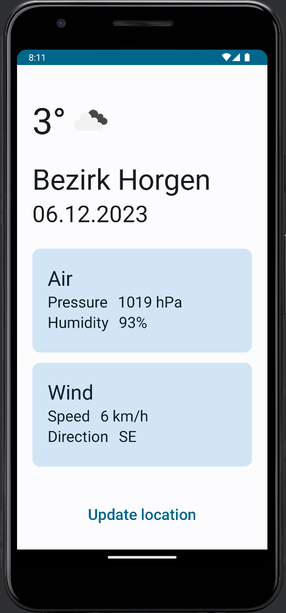
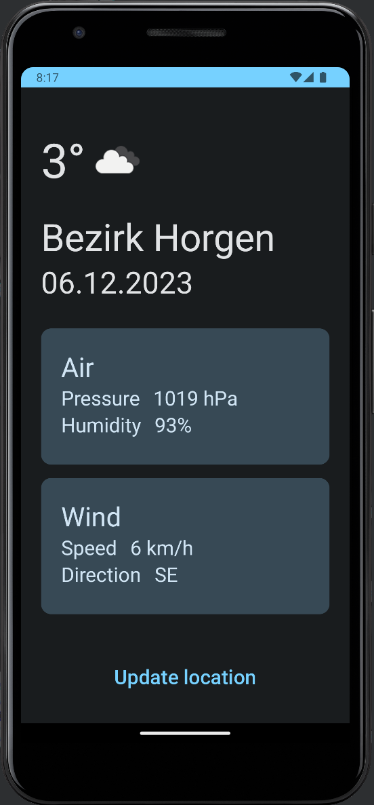

# Weather App

## Beschreibung

Wetter-App die diverse Wetterdaten des jetzigen Gerätestandorts anzeigt. Mithilfe der Gerätelocation werden die
Wetterdaten werden mit dem [OpenWeatherMap API](https://openweathermap.org/api) gefetched, mit Retrofit auf (automatisch
generierte) Datenklassen gemapped und dann in der App angezeigt.

## Auflistung zur Erreichung der Mindestpunktzahl

Zu Beginn des Projektes habe ich folgende Punkte notiert:

* Kotlin (3P)
* Funktionalität: 1 Screen (1P)
* Verwendung von Webservices (1P)
* Verwendung von Autoren oder Sensoren: Location (1P)
* Verwendung von Jetpack-Komponenten: Compose (1P)

Somit sollte die Mindestpunktzahl von 7 Punkten erreicht werden. Während des Projektes kamen jedoch noch zusätzliche
Punkte dazu, welche unten aufgelistet sind:

* Verwendung von Jetpack-Komponenten: ViewModel aus androidx.lifecycle (1P)
* Verwendung von Drittkomponenten: Retrofit2 (1P)
* Ressourcen: Unterschiedliche Styles: Dark-Theme (1P)

Somit sollte die Mindestpunktzahl mit 10 Punkten mehr als erreicht sein.

## Screenshots

    
    

